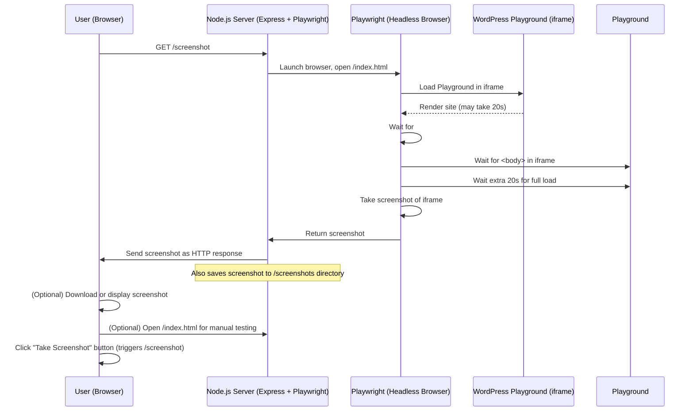

# WordPress Playground Screenshot Automation

This project allows you to automate screenshots of a WordPress Playground instance using Node.js, Express, and Playwright.

## Architecture Diagram

## Usage

- Start the server: `node server.js`
- Open `index.html` in your browser for manual testing, or call `/screenshot` for automated screenshots.
