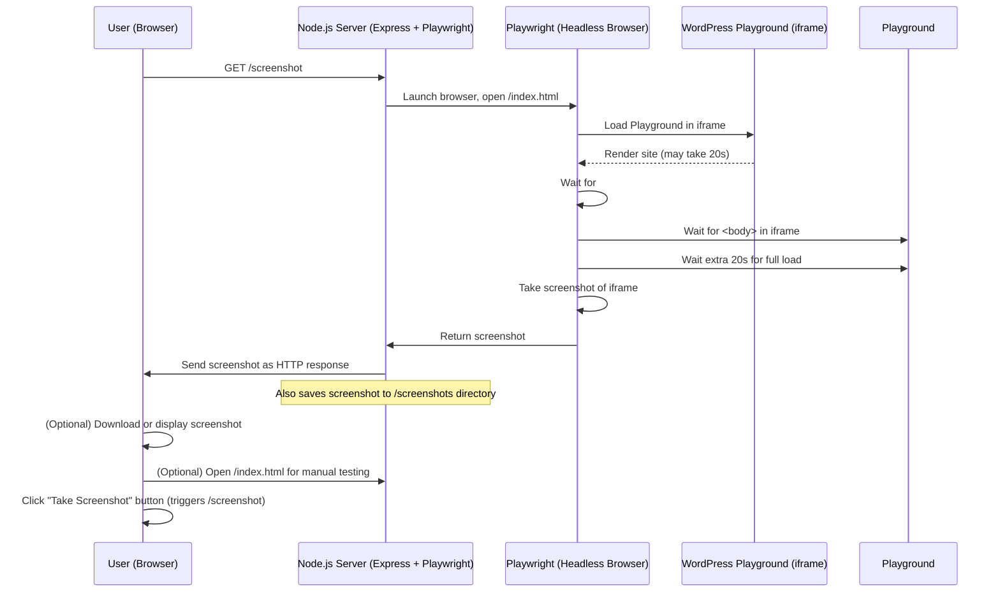

# WordPress Playground Screenshot Automation

This project allows you to automate screenshots of a WordPress Playground instance using Node.js, Express, and Playwright.

## Features

- Automated, reliable screenshots of WordPress Playground
- Manual and automated usage
- Debug mode for troubleshooting
- Screenshots saved to `/screenshots` directory

## Getting Started

1. **Fork and clone this repository:**
   ```bash
   git clone https://github.com/bph/your-repo.git
   cd your-repo
   ```

2. **Install dependencies:**
   ```bash
   npm install
   ```

3. **Install Playwright browsers (if needed):**
   ```bash
   npx playwright install
   ```

4. **Start the server:**
   ```bash
   node server.js
   ```
How to use it: 

1. Open the Playground manually (for testing or debugging): http://localhost:3000/index.html in your browser.
2. Take an automated screenshot: Visit http://localhost:3000/screenshot in your browser, or use a tool like curl: curl http://localhost:3000/screenshot --output screenshot.png
The server will load the Playground, wait for it to finish, and return a screenshot.
3. Debug mode (see the browser window): Visit http://localhost:3000/screenshot?debug=true

> **Note:**  
> If you use a different port or host, adjust the URLs accordingly.

## Architecture Diagram


---
Caveat: This is only a proof of concept for educational purposes, mostly mine. The code was created together with Cursor AI. Please check for security and bugs before using any of this in production. 

You could modify it to use with a dynamic playground blueprint for instance if you want to create a set of screenshot for a webdirectory. Or a list of demo sites for our products categories. Or for visual regression testing. 

The blueprint is hardcoded in the index.html to show a screenshot of the theme demo of Twenty-Twenty-Five. Consult the [WordPress Playground Blueprint API](https://wordpress.github.io/wordpress-playground/blueprints) documentation to modify things to your needs. 

## License

   This project is licensed under the GNU General Public License v3.0 (GPL-3.0).
   See the [LICENSE](LICENSE) file for details.
